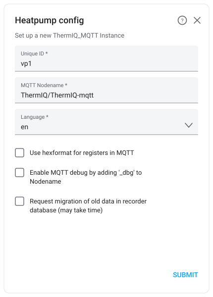

# Home Assistant ThermIQ Integration
[](https://github.com/custom-components/hacs)

> **This is a maintained fork** of [ThermIQ/thermiq_mqtt-ha](https://github.com/ThermIQ/thermiq_mqtt-ha) with additional bug fixes. It is **not** in the HACS default list, so it must be added as a custom repository — see step 7 below.


*The [animated SVG widget](lovelace/README.md): pipe colour tracks temperature all the way round the machine. Shown here as a static render with demo values — in Home Assistant the flows animate and the compressor turns.*

This integration allows you to use the **ThermIQ-MQTT** and **ThermIQ-Room2** hardware interface to control and monitor your Thermia or Danfoss heatpump from Home Assistant. It is actively supported both here and at [Thermiq.net](https://thermiq.net)

**Please support the continous development by buying a ThermiQ-room2 from ThermIQ, we are a small company and Your support makes a difference!**
Get the neccessary hardware from [Thermiq.net](https://thermiq.net), where you also can read more about our products and background. 


## Important release notes
From v3.5.0:
   - The PNG-based dashboard visualization is retired. `ThermIQ_Card.yaml` now uses the [animated SVG widget](lovelace/README.md), and the `vp_base*.png` images and the HTML Jinja2 Template card are no longer needed.
   - The card's controls now reference the `number`/`select`/`switch` entities introduced in v3.3.0 instead of the old `input_*` names. See [Upgrading the dashboard card](#upgrading-the-dashboard-card).
   - Three HACS frontend dependencies dropped: the HTML Jinja2 Template card, Number Box and apexcharts-card. The card now needs only fold-entity-row.

From v3.x:
   - the units used in the db recorder have been corrected, an attempt to upgrade the existing database is done at start. Also try the "Developer Tools" Statistics tab if built in conversions fail
   - The EVU is now a boolean value better representing the ON/OFF function
   - The Lovelace card has breaking changes, adding a max peak powerconsumption per hour. See below for instructions.


# Steps to install ThermIQ HA Integration

> **Don't want to read all this?** [Let an AI agent install it for you](AI_INSTALL.md).
> You paste one prompt and answer a couple of questions; the agent finds your heat pump
> on MQTT, installs the integration, configures it and verifies that real values arrive.
> That page also spells out exactly what access it needs, and what it is not allowed to do.
> The manual steps below still work if you prefer them.

1. Install the Mosquitto Add-on in Home Assistant.
2. Install [MQTT Explorer](https://mqtt-explorer.com/) on your PC and verify that you can connect to Mosquitto
3. Configure your **ThermIQ** device according to the instructions at [Thermiq.net](https://thermiq.net)
4. Use MQTT-Explorer to verify that your **ThermIQ** device is sending information to Mosquitto. You should see MQTT messages in MQTT-Explorer from the heatpump every 30s
5. Install the MQTT Integration in Home Assistant and verify that it's communicating with the Mosquitto Add-on.
6. Install [HACS](https://github.com/custom-components/hacs)
7. Add this fork as a HACS **custom repository**: HACS &rarr; the &#8942; menu (top right) &rarr; *Custom repositories* &rarr; paste `https://github.com/larsablixth/thermiq_mqtt-ha`, category *Integration*, then **Add**.
   This step is required: this fork is not in the HACS default list, and without it HACS will offer the upstream ThermIQ version instead of this one.

   Then click [](https://my.home-assistant.io/redirect/hacs_repository/?owner=larsablixth&repository=thermiq_mqtt-ha&category=integration) to open it in HACS and install the ThermIQ-MQTT integration,
   or go to the HACS integrations page and add the ThermIQ integration from there.
8. Restart HA
  
9. Go to Integrations and add ThermIQ.
   1. 

      > *Schematic of the config dialog, generated from the integration's config flow — field order, labels and defaults match the code. It is a diagram rather than a screenshot, so Home Assistant's own styling will differ slightly.*

   2. **Unique ID** &mdash; identifies this heatpump, default **vp1**. It is embedded verbatim in every entity id (`sensor.thermiq_mqtt_vp1_...`), so choose it before building dashboards &mdash; changing it later renames every entity. Only lowercase letters, digits and underscores are accepted. Use a different value for each heatpump if you set up more than one.
   3. **MQTT Nodename** &mdash; the same as you set during wifi-config in step 3, without a "/" at the end
   4. **Language** &mdash; language used for the entity friendly names. One of `en`, `se`, `fi`, `no`, `de`.
   5. **Use hexformat for registers in MQTT** &mdash; only if you have the old 1.xx ThermIQ-MQTT firmware
   6. **Enable MQTT debug** &mdash; diverts all writes to the `dbg_write` / `dbg_set` topics, so you can try the integration out without actually writing to the heatpump
   7. **Request migration of old data in recorder database** &mdash; only needed when upgrading from an older version whose recorded units or entity ids differ. It rewrites history in the recorder database and may take a long time on a large database. Leave it **off** for a fresh install.
10. To control and monitor the heatpump from your dashboard:

   The visualization is the [animated SVG widget](lovelace/README.md) — live temperatures as pipe colours, flow arrows that appear only when the medium actually moves, and an orbiting scroll compressor. It replaced the old PNG-based picture in v3.5.0; see [Upgrading the dashboard card](#upgrading-the-dashboard-card) if you are coming from an earlier version.

   The widget ships **inside the integration** — installing it through HACS is the whole install. There is nothing to copy into `www/` and no dashboard resource to register. Just make sure you restarted Home Assistant after installing (step 8), and hard-refresh the browser (Ctrl/Cmd+Shift+R) the first time so it picks up the card.

   1. HACS->Frontend->Explore/Add [fold-entity-row](https://github.com/thomasloven/lovelace-fold-entity-row)
   2. Go to your dashboard and add a new manual card
   3. Copy/paste the contents of [ThermIQ_Card.yaml](https://github.com/larsablixth/thermiq_mqtt-ha/blob/master/ThermIQ_Card.yaml) into your manual card
   4. Before you save the card, adjust the ID if you've used anything else than the default **vp1** when setting up the integration. [hint: Ctrl+F with find/replace is your friend]

### Upgrading the dashboard card

If you built your dashboard before v3.5.0, replace your existing ThermIQ card with the current [ThermIQ_Card.yaml](https://github.com/larsablixth/thermiq_mqtt-ha/blob/master/ThermIQ_Card.yaml). What changed:

- **The widget is installed for you now.** If you followed earlier instructions and copied `thermiq-widget-card.js` and `heatpump_widget.j2` into `www/thermiq/`, you can delete them and remove the `/local/thermiq/thermiq-widget-card.js` resource from *Settings &rarr; Dashboards &rarr; Resources* — the integration serves its own copy. Leaving them registered loads the card twice.

- **The PNG visualization is gone.** The `html-template-card` block that composited `vp_base.png` / `vp_base_hgwon.png` / `vp_base_hw.png` is replaced by the SVG widget, so those three images and the [HTML Jinja2 Template card](https://github.com/PiotrMachowski/Home-Assistant-Lovelace-HTML-Jinja2-Template-card) dependency are no longer needed. You can delete the images from **www/community/**.
- **The controls point at the new entity domains.** Since v3.3.0 the integration provides `number.*`, `select.*` and `switch.*` entities instead of hijacking `input_number.*`, `input_select.*` and `input_boolean.*`. The old card still referenced the `input_*` names, so its controls stopped working after that upgrade; the current card uses the correct ones.
- **[Number Box](https://github.com/htmltiger/numberbox-card) is no longer needed.** The integration's `number` entities already present as input boxes, so the card uses plain rows and you can remove that HACS frontend card if nothing else on your dashboard uses it.
- **[apexcharts-card](https://github.com/RomRider/apexcharts-card) is no longer needed either.** The runtime chart is now a built-in `statistics-graph` using the weekly `change` statistic. Both runtime series are drawn as bars rather than one column plus one line, since a `statistics-graph` uses a single chart type for all its entities.

Your own helper entities for energy control (`input_number.vp1_electricity_price_threshold` and friends) are unaffected — they are still `input_*`, because you create them yourself. Set their *Display mode* to **Box** when creating them if you want them to look like the rest of the card; helpers created as sliders will render as sliders.
  
### Debugging

Use [MQTT Explorer](https://mqtt-explorer.com/) to ensure your heat pump is communicating with the **Mosquitto** before setting up HA.

Home Assistant server sometimes needs to be restarted once all configuration is done

Make sure you use the right MQTT Nodename when configuring the HA Integration. The MQTT-Nodename is the same as the base **"Topic"** in MQTT-Explorer (without /data)

  
# ThermIQ Energy Control for **ThermIQ-Room2**
You can optimize energy usage directly from Home Assistance by using the excellent **AIO Energy Management** Plugin from [here](https://github.com/kotope/aio_energy_management)  


Steps to install:
1. Click **AIO Energy Management** [](https://my.home-assistant.io/redirect/hacs_repository/?owner=kotope&repository=aio_energy_management&category=integration) and install it
2. Follow the instructions on how to configure [**AIO Energy Management** together with either Nordpool or Entso-e](https://github.com/kotope/aio_energy_management)
3. In HA->Settings->Devices&Services-> Helpers, Create three new number helpers 

   - **vp1_electricity_price_threshold** with a reasonable price range and step size of 0.01
   - **vp1_electricity_low_hours** with a a range from 0-23, Step size 1
   - **vp1_powerconsumption_max** with a range from 0-20, Step size 0.25  
   
    Create two switch helpers  
   - **vp1_enable_energy_control**
   - **vp1_force_evu**
     
4. Add the following to your **configuration.yaml** file, use the correct nordpool/entso-e sensor for your setup. 
```
aio_energy_management:
    cheapest_hours:
    - nordpool_entity: sensor.nordpool_kwh_se3_sek_3_10_025
      unique_id: vp1_cheapest_hours
      name: VP1 Cheapest Hours
      first_hour: 0
      last_hour: 23
      starting_today: false
      number_of_hours: input_number.vp1_electricity_low_hours
      sequential: False
      failsafe_starting_hour: 21
    calendar:
      name: My Energy Management Calendar
      unique_id: my_energy_management_calendar
```

5. Add the following to you **automations.yaml** file, use the correct nordpool/entso-e sensor for your setup. Make sure you match the mqtt topic to your setup
```
# Update the nordpool sensor and accumulated_consumption_current_hour
# Change the MQTT topic
#
- alias: Update AIO Energy Management
  description: Update AIO cheapest hours based on current settings
  triggers:
  - trigger: state
    entity_id: input_number.vp1_electricity_low_hours
  action:
    service: aio_energy_management.clear_data
    data:
      unique_id: vp1_cheapest_hours
  id: bc899c680e3e4bc1a57f6f20f92678cc

- alias: Set EVU based on price
  description: Cheapest hours turn off EVU, (most expensive turns on))
  triggers:
  - trigger: time_pattern
    hours: '*'
    minutes: '1'
  - trigger: state
    entity_id: input_number.vp1_electricity_price_threshold
  - trigger: state
    entity_id: input_boolean.vp1_enable_energy_control
  - trigger: state
    entity_id: input_boolean.vp1_force_evu
  - trigger: state
    entity_id:
    - binary_sensor.vp1_cheapest_hours
    attribute: updated_at
  - trigger: state
    entity_id: binary_sensor.vp1_cheapest_hours
  - trigger: homeassistant
    event: start
  - trigger: template
    value_template: '{{ states(''sensor.accumulated_consumption_current_hour'')
      > states(''input_number.vp1_powerconsumption_max'')  }}'
  action:
  - if:
    - condition: and
      conditions:
      - condition: state
        entity_id: input_boolean.vp1_force_evu
        state: 'off'
      - condition: or
        conditions:
        - condition: state
          entity_id: binary_sensor.vp1_cheapest_hours
          state: 'on'
        - condition: state
          entity_id: input_boolean.vp1_enable_energy_control
          state: 'off'
        - condition: numeric_state
          entity_id: sensor.nordpool_kwh_se3_sek_3_10_025
          below: input_number.vp1_electricity_price_threshold
      - condition: numeric_state
        entity_id: sensor.accumulated_consumption_current_hour
        below: input_number.vp1_powerconsumption_max
    then:
    - service: mqtt.publish
      data_template:
        topic: ThermIQ/ThermIQ-room2/set
        payload: '{"EVU":0}'
    else:
    - service: mqtt.publish
      data_template:
        topic: ThermIQ/ThermIQ-room2/set
        payload: '{"EVU":1}'
  id: 04d33b769f62434d8f560e6c17af2841
```

6. **Restart Home Assistant**
7. You will now be able to use the **Energy Management** Tab in the ThermIQ panel to enable energy control, set your low cost limit and select the number of hours you want to have enabled and a max hourly power cutoff to avoid peak power charges. The AIO and ThermIQ-Room2 will make sure the hours selected are the cheapest ones. Use MQTT-Explorer to ensure you get the expected behaviour.


# Misc
#### Automations
No setup of automations is needed. You can use the normal `number` services to change a value in the heatpump. For example:

```service: number.set_value
data: {"entity_id": "number.thermiq_mqtt_vp1_indoor_requested_t", "value":20}
```

#### Available data
The data available is listed in [REGISTERS.md](https://github.com/larsablixth/thermiq_mqtt-ha/blob/master/REGISTERS.md)

#### Forced legionella heating
See this [thread](https://github.com/ThermIQ/thermiq_mqtt-ha/issues/66#issuecomment-3594762404) for a possible way of forcing a legionella run when energy is cheap


#### Features and Limitations
- Currently provides all data from the heatpump in the form of sensors and binary sensors
- Allows control over the heatpump 
#### A web UI, with or without Home Assistant
[**thermiq-bridge**](https://github.com/larsablixth/thermiq-bridge) is a companion project:
the same MQTT, the same registers generated from this repository's register table, and the
same animated widget generated from this repository's template - as one static binary in a
202 kB container, with its own web UI, a JSON API and Prometheus metrics, and no HACS cards
of any kind.

Run it standalone if you would rather not run Home Assistant, or install it as a Home
Assistant add-on and it appears in your sidebar. See it with
`docker run --rm -p 8080:8080 -e THERMIQ_DEMO=1 thermiq-bridge`.

**As an add-on**, on Home Assistant OS or Supervised: *Settings &rarr; Add-ons &rarr; Add-on
store &rarr; the three-dot menu &rarr; Repositories*, add
`https://github.com/larsablixth/thermiq-bridge`, then install **ThermIQ Bridge** and set
`mqtt_host`, `node` and `id`. Set `read_only: true` if you would rather it could never write
to the pump.

Three things worth knowing before you choose it over the dashboard card:

- **It is a sidebar panel, not a dashboard card.** It cannot sit among your other cards - an
  `iframe` card pointed at it returns 401, because ingress only authenticates when Home
  Assistant's own frontend opens the panel. Full page in the sidebar, or nothing.
- **Add-ons need Supervisor.** Home Assistant Container and Core installs cannot use this
  route; the card is the only option there.
- **It is young.** The add-on was not installable at all until 12 August 2026, and the first
  half hour of real runtime found a keepalive bug (v0.1.4). The aarch64 build - which is what
  a Raspberry Pi runs - is cross-compiled and published but has not yet been run by anyone.

What it does buy you is a widget with no custom-element machinery behind it: no card module to
load, so none of the browser-side failure modes that come with one.

#### ThermIQ-USB Support
Tom R has created [a Node-RED flow](https://github.com/tomrosenback/thermiq-node-red-homeassistant-config) converting the previous version, ThermIQ-USB, to use the same MQTT messages making it compatible with this integration.

#### Domoticz Support
If you are looking for a Domoticz version, it's available from Jack: [Domoticz](https://github.com/jackfagner/ThermIQ-Domoticz)

# Contributing
Contributions are welcome! If you'd like to contribute, feel free to pick up anything on the current [GitHub issues](https://github.com/ThermIQ/thermiq_mqtt-ha/issues) list!
The naming, translation and grouping of registers can be improved, your input is appreciated. Most of it is in the [thermiq_regs.py](https://github.com/larsablixth/thermiq_mqtt-ha/blob/master/custom_components/thermiq_mqtt/heatpump/thermiq_regs.py)  

All help improving the integration is appreciated!


