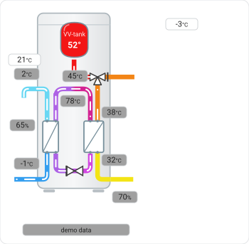

# Animated heat-pump widget

A live SVG schematic of the heat pump as a Lovelace card. Since v3.5.0 this
is the visualization used by `ThermIQ_Card.yaml`, replacing the PNG-based
picture that came before it.

The whole machine is drawn as one SVG: cabinet, brine loop, evaporator,
scroll compressor, condenser, hot-water tank, 3-way valve, radiator
circuit and (optionally) a pool / second heating circuit.



Everything on screen tells the truth about the machine:

- **Color is temperature, everywhere.** Every pipe, badge and vessel is
  colored from the live register value on shared scales (water, hot gas
  and brine each have their own palette).
- **Flows render only when physically flowing.** Arrows and waves appear
  when the corresponding pump/compressor/valve state says the medium
  moves; an idle machine is a still picture.
- **Mechanics animate true to their kinematics.** The scroll compressor's
  orbiting spiral translates in a circle without rotating, exactly like
  the real thing; circulation pump impellers spin only while running.
- Conditional drawing: HGW branch appears only when
  `opt_hgw_installed` is on, alarm state turns the background red, the
  auxiliary boiler steps and EVU block have their own indicators.

## Why a custom card?

Template cards that re-render by replacing `innerHTML` restart every CSS
animation each time any referenced entity changes — with ~25 live
entities (including the pump's own clock) that means visible stuttering
every few seconds. `thermiq-widget-card` subscribes to HA's
`render_template` websocket API and applies each update by **DOM
morphing**: only attributes and text that actually changed are touched,
so animations run uninterrupted. It has no dependencies.

## Install

**Nothing to install.** The card ships inside the integration, which serves it
at `/thermiq_mqtt_frontend/` and registers it with the frontend on startup — no
files to copy into `www/`, and no dashboard resource to add by hand.

1. Restart Home Assistant after installing the integration, if you haven't
   already. The card is registered during setup, so it doesn't exist until
   the integration has loaded once.

2. Hard-refresh the browser (Ctrl/Cmd+Shift+R) the first time, so it picks up
   the newly registered module instead of a cached page.

3. Add it to a dashboard **as a card**:

   ```yaml
   type: custom:thermiq-widget-card
   ```

   If your integration entry ID isn't the default `vp1`:

   ```yaml
   type: custom:thermiq-widget-card
   entity_prefix: thermiq_mqtt_myid
   ```

   The widget draws itself inside an `ha-card`, so it picks up the background,
   corner radius and elevation of the active theme like any other card. If you
   are nesting it inside a card of your own and do not want two:

   ```yaml
   type: custom:thermiq-widget-card
   card: false
   ```

   **Not as a row inside an `entities` card.** It renders there, but only
   sometimes: Home Assistant builds rows with `createRowElement`, and when a
   custom element isn't defined yet it substitutes an error placeholder and
   fires `ll-rebuild` once the definition arrives. `hui-card` listens for that
   event and rebuilds; the entities card does not. Since this card is loaded
   as a module by the integration, it frequently *isn't* defined yet on a
   fresh page load — so the row shows an error on every reload, then works
   after navigating away and back, which makes it look like a caching
   problem rather than a placement one.

   To keep it next to the entity list, wrap both in a stack — that is what
   `ThermIQ_Card.yaml` does:

   ```yaml
   type: vertical-stack
   cards:
     - type: custom:thermiq-widget-card
     - type: entities
       entities: ...
   ```

Editing the visualization means editing
`custom_components/thermiq_mqtt/frontend/heatpump_widget.j2` and reloading the
page — the card fetches the template with `cache: "no-store"` on each page
load, which bypasses the browser cache, so edits show up immediately.

The card file itself *is* cached, like every other frontend module, and is
busted by the `?v=` on its import URL. Editing `thermiq-widget-card.js`
therefore also means bumping `CARD_VERSION` in `__init__.py`.

### If it doesn't come up

1. **Has the integration loaded?** The card is registered during setup, so it
   does not exist until Home Assistant has started with the integration
   installed. Check *Settings → Devices & Services* for ThermIQ, and the log
   for `Could not register the ThermIQ dashboard card`.
2. **Is the card served?** Open
   `http://<your-ha>:8123/thermiq_mqtt_frontend/thermiq-widget-card.js` in a
   browser. You should get JavaScript. A 404 means the static path was not
   registered — see the log line above.
3. **Custom element doesn't exist: thermiq-widget-card.** The module was not
   loaded by the browser. Hard-refresh (Ctrl/Cmd+Shift+R); the browser console
   will show whether the `.js` request failed.
4. **Card loads but shows an error box.** The card prints
   `cannot load /thermiq_mqtt_frontend/heatpump_widget.j2` inside the card
   when the template fetch fails, which points back at step 2.
5. **Card draws but values are blank or the pump looks idle.** The template
   reads `sensor.thermiq_mqtt_vp1_*`. If your integration entry ID isn't
   `vp1`, set `entity_prefix` on the card as shown above; the widget cannot
   guess it.

**Upgrading from a manual install.** If you previously copied the files into
`www/thermiq/` and registered `/local/thermiq/thermiq-widget-card.js` as a
resource, three things need undoing:

1. Remove the `/local/thermiq/thermiq-widget-card.js` resource from
   *Settings → Dashboards → ⋮ → Resources*, or the card is loaded twice from
   two different versions.
2. Delete `/config/www/thermiq/`.
3. **Check your card for a `template_url:` line and delete it.** Older
   instructions had you point the card at `/local/thermiq/heatpump_widget.j2`.
   That path no longer exists, so a card still pinning it fails to load its
   template. Left alone, the card uses the path the integration serves.

Your card config should be just:

```yaml
type: custom:thermiq-widget-card
```

**If a card shows "Configuration error" after any of this**, note that Home
Assistant only displays that generic string — the real message ("Custom
element doesn't exist: …") appears only when you click the pencil to edit the
dashboard. Note also that a failed module load is cached by the browser for
the lifetime of the tab: if you loaded the page while Home Assistant was
restarting, the card stays broken until you reload it again once Home
Assistant is fully up, no matter what you fix in between.

## If the card will not behave

Every failure mode above is browser-side: a module that has to load, define a custom element,
and win a race against Lovelace's first render. If you are on Home Assistant OS or Supervised
and would rather not have that machinery at all, the same widget is available with none of it.

[**thermiq-bridge**](https://github.com/larsablixth/thermiq-bridge) draws this picture from
this very template - byte-for-byte identical, asserted in its CI - and serves it as its own
page. Installed as an add-on it appears in your sidebar: *Settings &rarr; Add-ons &rarr; Add-on
store &rarr; three-dot menu &rarr; Repositories*, add
`https://github.com/larsablixth/thermiq-bridge`, install **ThermIQ Bridge**, set `mqtt_host`,
`node` and `id`.

It is an alternative, not a replacement, and the honest trade is:

| | this card | the add-on |
|---|---|---|
| sits among your other cards | yes | no - full-page sidebar panel only |
| works on Container / Core installs | yes | no - needs Supervisor |
| custom element to load | yes | none |
| runtime behind it | since v3.5.0, several installs | first installable 12 Aug 2026 |

The aarch64 image a Raspberry Pi would run is published but has not yet been run by anyone, so
treat it accordingly for now.

## Optional extras

**Pool / second heating circuit.** This needs an optional expansion card
fitted in the heat pump — most pumps don't have one. It provides the
second heating circuit, which the pump calls **Curve 2** and which this
integration exposes as the `integral2_*` registers (curve slope, min,
max, target, actual). Note this is a separate thing from the pump's
`shunt1_*` / `shunt2_*` / `shunt_cooling_*` signals, which exist on
pumps without the expansion card.

If you don't have the card, skip this section: the widget never draws
the pool branch. If you do use the second circuit (e.g. for a pool),
define a template binary sensor named
`binary_sensor.pool_heating_active`; while it is `on` the widget draws
the secondary heat-exchanger branch with flow animation. Example
(strict "actually heating right now" semantics):

```yaml
template:
  - binary_sensor:
      - name: pool_heating_active
        state: >
          {{ states('number.thermiq_mqtt_vp1_integral2_curve_target')|float(0) > 10
             and is_state('binary_sensor.thermiq_mqtt_vp1_compressor_on','on')
             and is_state('binary_sensor.thermiq_mqtt_vp1_supply_pump_on','on')
             and is_state('binary_sensor.thermiq_mqtt_vp1_hotwaterproduction_on','off') }}
```

**Flow speed.** The arrows move at the speed the pumps report. Each circuit
carries a CSS multiplier taken from its own pump — `--vpw` from the supply
pump, `--vpb` from the brine pump — and every duration and chevron delay in
that circuit is expressed against it, so an arrow trail stays evenly spaced
however fast it runs. The refrigerant loop is deliberately left fixed: the
compressor is single-speed, so a rate there would be invented rather than
measured.

**Pool temperature.** The pool branch takes its temperature from
`sensor.…_supply_shunt_t` — register `r0b`, the pump's own shunt-circuit
sensor, which the widget labels *Pool temp actual* and prints in the caption
beside the target. The pool body and the pipe leaving the pool are drawn in
that colour; the pipe returning to the pool is drawn warmer by the whole
supply-to-return drop the pump is currently producing, clamped to 0–40 K so
that a missing or absurd reading cannot throw the colour off the scale.

It takes the whole drop deliberately. An earlier version capped the rise at
3 K on the reasoning that a pool circuit runs high flow and low delta — but
whatever the flow does on the pool side, the exchanger can only pass on what
the heat pump gives it, and at 3 K the two pipes were very nearly the same
colour, which is the one thing the pair is there to show.

So **fit the probe in the pool and the drawing follows** — nothing here needs
changing. Until then it reads wherever the sensor actually sits, which on a
stock install is the boiler room, and the caption shows that number honestly
rather than pretending it is pool water. If `r0b` has no reading at all the
colour falls back to the curve-2 target, which is a setpoint: it says where
the water is heading rather than where it is.

**Demo mode.** Create `input_boolean.hpviz_demo` and toggle it to stage a
hot-water charging cycle visually (forced flows, staged 63 °C tank
color) without touching the pump — handy for testing the card or showing
it off. Without the helper, demo mode is simply off.

## Editing the template

`heatpump_widget.j2` is rendered twice: by Home Assistant's Jinja2 here, and
by a small hand-written compiler in
[thermiq-bridge](https://github.com/larsablixth/thermiq-bridge), which turns it
into C so the add-on can draw the same widget with no Python at all. That
compiler implements a deliberate subset, and its test suite renders both and
compares them byte for byte.

So an expression that is perfectly good Jinja2 can still be un-vendorable. The
one to know: clamp with `([lo, value, hi]|sort)[1]`, which the compiler
supports and which the colour macros already use throughout — not `|min` or
`|max`, which it does not. If you add a construct it cannot handle, its
`Generated sources are current` job fails with the reason.

## Compatibility note

The widget reads the integration's sensors and binary sensors, plus
`number.…_integral2_curve_target` for the pool-target colour and
`switch.…_heatpump_evu_block` for the EVU badge. All of these exist on this
fork. Against **upstream** ThermIQ, which still uses the `input_*` platforms,
those two references fall back to defaults and everything else works
unchanged.
